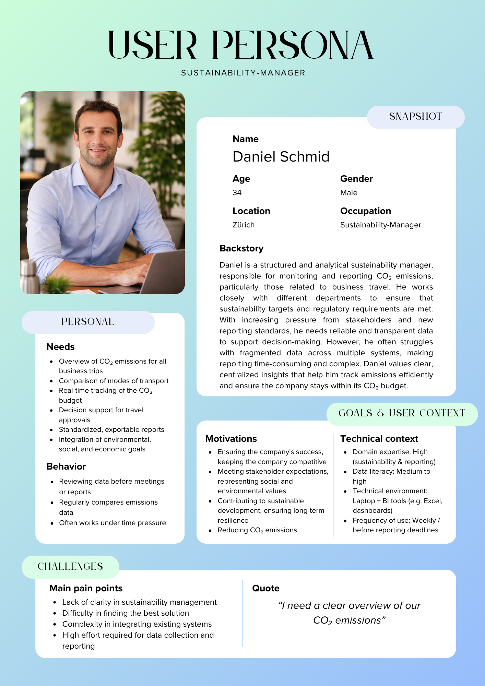
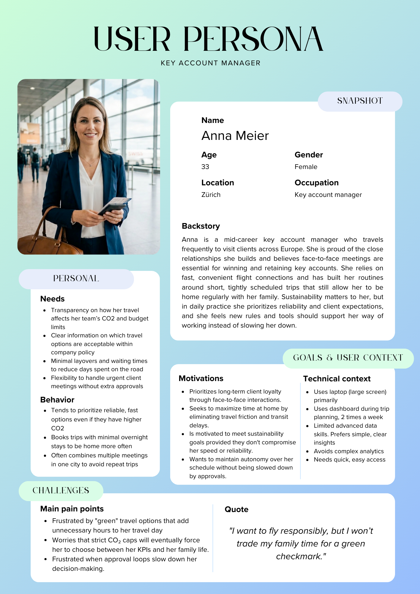

# Project Charta

---

## Context and Scope

The Carbon Gatekeeper Dashboard is an interactive tool designed to manage and reduce CO₂ emissions from business travel by linking travel decisions directly to carbon budgets at the department level. Moving beyond retrospective reporting, the dashboard provides real-time, data-driven guidance at the point of planning. The project is designed to answer three core questions:

> *"What is the current CO₂ budget status for my business unit?"*
>
> *"What is the CO₂ difference between flight routes and alternative transport modes?"*
>
> *"Based on our remaining budget, which transport mode is the recommended choice for a specific trip in terms of carbon, cost, and time?"*

A central component is the **Departmental Budget Monitor**, which uses a gauge system to compare accumulated emissions with annual CO₂ budgets, classifying units as Low, Medium, or High. The dashboard also includes a **Potential Analysis** feature that highlights routes where sustainable alternatives exist. By comparing flight emissions with rail, bus, and car equivalents, the tool quantifies "avoidable CO₂" to make reduction opportunities actionable. Additionally, an **interactive trip evaluation tool** allows users to filter specific routes and compare travel options based on emissions, cost, and time, providing a recommendation tailored to the unit's current budget status.

The project scope involves developing a functional dashboard prototype that integrates these features into a single interface. This includes implementing CO₂ calculation logic, aggregating emissions data by business unit, and establishing a rule-based system for travel recommendations. The primary deliverable is an interactive tool that supports transparent monitoring and informed decision-making. While limited to business travel using existing data and excluding external booking system integrations, the project offers significant benefits in operationalizing sustainability targets. The final product will be published as a web-based prototype via Streamlit and GitHub Pages, ensuring stakeholders can access the tool directly through a browser without additional software.

---

## Project Objectives and Success Criteria

The primary objective of this project is to deliver the "Carbon Gatekeeper" Dashboard, a functional prototype that moves the organization from retrospective reporting to active, point-of-planning travel management.

Specifically, the dashboard enables stakeholders to answer three core questions:

- **Budget Status** — *"What is the current CO₂ budget status for my business unit?"* (comparing actual emissions to yearly `co2_budget_t` using a Low/Medium/High gauge system)
- **Impact Comparison** — *"What is the CO₂ difference between flight routes and alternative transport modes?"* (quantifying the "avoidable CO₂" for routes where `train_alternative_available` is TRUE)
- **Actionable Guidance** — *"Based on our remaining budget, which transport mode is the recommended choice for a specific trip?"* Providing tailored recommendations like "MUST TAKE TRAIN" or "TRAVEL RESTRICTED"

### Success Criteria

**Qualitative Objectives**

- **Actionability** — The tool transforms complex data into a rule-based system for travel recommendations, aiding informed decision-making.
- **Transparency** — The dashboard provides a clear, hierarchical view of emissions, allowing users to distinguish between Business Units (BU1–4).
- **Accessibility** — Stakeholders can access the tool directly through a web browser via a Streamlit and GitHub Pages deployment without needing additional software.

**Quantitative Metrics**

- **Data Accuracy** — 100% of calculations must utilize the CO₂ metric to ensure high-fidelity environmental impact reporting.
- **Feature Integration** — The prototype must successfully integrate three core components: the Budget Monitor (Gauge), the Potential Analysis (Modal Shift), and the Trip Evaluation Tool into a single interface.
- **Filter Functionality** — The dashboard must allow users to filter data by transport mode and organizational departments.
- **Recommendation Logic** — The simulator must accurately trigger "RESTRICTED" status when a department exceeds 100% of its assigned budget.

### Out of Scope

- **Predictive Analytics** — Forecasting future travel demand or long-term CO₂ trajectories
- **Full Footprint Accounting** — Inclusion of emissions outside of business travel (e.g., office energy or supply chain)
- **External Integration** — Real-time synchronization with live booking systems or HR databases
- **Automated Enforcement** — The tool provides recommendations and status alerts but does not physically block external booking transactions

---

## Stakeholder Analysis

### Sustainability Manager
> *"Numbers don't lie, neither does our planet"*

| | |
|---|---|
| **Role** | Responsible for company-wide monitoring of CO₂ emissions and achieving sustainability goals. This role operates across departments and does not focus on a single department but rather considers the entire company. The sustainability manager prepares reports for senior management and communicates progress to external stakeholders such as investors or regulatory agencies. |
| **Goal** | Monitor corporate travel emissions, identify savings, and track progress against the CO₂ budget. |
| **Dashboard interest** | **Very High.** As the primary user, they need to answer one question at any given moment: are we within budget, and if not, why? This tool replaces manual evaluations and is critical for their sustainability reporting. |

---

### Travel Manager
> *"Every trip planned, every policy enforced"*

| | |
|---|---|
| **Role** | Responsible for the operational coordination of all business travel within the company. The Travel Manager manages framework agreements with airlines, hotels, and rail carriers, and approves or denies travel requests. They are the first to notice when travel patterns get out of hand and act before they escalate, whether in terms of costs or emission. |
| **Goal** | Oversee all trip requests/approvals, identify policy violations, and actively promote sustainable travel alternatives. |
| **Dashboard interest** | **Very High.** This is a daily operational tool used to filter by transport mode, destination and department. The transport mode comparison is a core feature for this role. Spotting trips where a alternative connection was available, but a flight was booked anyway is exactly the policy violation the Travel Manger needs to act on. |

---

### Finance / Controlling
> *"No budget, no ticket"*

| | |
|---|---|
| **Role** | Responsible for monitoring all travel-related expenses and ensuring that budgets are adhered to across the company. The Finance team tracks spending across all departments and must flag deviations early before they become a budget problem. As business travel can represent a significant cost factor, they need clear visibility into where money is being spent, by whom, and for what purpose. |
| **Goal** | Understand cost distribution by department and travel purpose and ensure that travel expenditures remain within planned budget limits. |
| **Dashboard interest** | **Medium.** Finance focuses on cost-related KPIs, total spend, cost per trip, cost per department and cost per transport mode. CO₂ data is secondary unless emission-related fees become budget-relevant. The dashboard's value lies in consolidating travel costs in one place, without manual data pulls from separate systems. |

---

### Management / Corporate
> *"Big picture, no noise"*

| | |
|---|---|
| **Role** | Senior decision-makers with overall responsibility for the company's strategic direction, including sustainability commitments and cost targets. Management sets the overarching CO₂ reduction goals and travel budget thresholds, and is accountable to external stakeholders such as investors, regulators, or board members. They do not engage with individual trip data or operational details. Their view is exclusively top-down. |
| **Goal** | Get a fast, reliable overview of whether the company is on track to meet its sustainability and cost targets and have a data-driven basis to initiate strategic corrections if needed. |
| **Dashboard interest** | **High.** Management needs a clean summary view. Current CO₂ budget consumption, overall spend, and trend direction. The transport mode comparison feature is particularly relevant here, as it supports strategic decisions like introducing mandatory rail travel policies below a certain distance threshold. Detailed filters or raw data views are not relevant for this group. They need clear indicators, not analysis tools. |

---

## User Analysis

The following personas represent key user groups of the dashboard. 
They were developed based on literature and domain-specific sources to reflect 
different perspectives on business travel and CO₂ management within the company.

### Persona 1: Daniel Schmid
{ width=70% }

### Persona 2: Anna Meier
{ width=70% }

### Sources

**Daniel Schmid**
- https://fis.leuphana.de/de/publications/nachhaltigkeitsmanagement-in-unternehmen-von-der-idee-zur-praxis-/
- https://www.hs-koblenz.de/fileadmin/media/fb_wirtschaftswissenschaften/Forschung_Projekte/Publikationen/Schriftenreihe_38_Schueller_Mengen.pdf
- https://ghgprotocol.org/sites/default/files/standards/ghg-protocol-revised.pdf
- https://www.mckinsey.com/industries/energy-and-materials/our-insights/global-energy-perspective

**Anna Meier**
- https://www.tourism-review.com/survey-shows-the-preferences-of-business-travelers-news14693
- https://www.ere.net/articles/face-value-business-travel-surges-as-virtual-meeting-fatigue-sets-in
- https://www.travelpress.com/study-finds-business-travellers-facing-stress-well-being-challenges/

---

## Situation Assessment

### Available Resources

**Data**

The primary data source is a dataset of more than 25,000 business travel records, including attributes such as travel mode, origin and destination, travel purpose, distance, travel cost and CO₂ emissions calculated using the CO2e RFI2.7 methodology. The dataset provides sufficient volume and attribute diversity to support budget monitoring, modal shift analysis and route-level trip evaluation.

**Personnel**

The project is carried out by a student team of four members with complementary roles covering project coordination, data analysis and preprocessing, dashboard development and user analysis. All members contribute collaboratively across tasks.

**Tools**

- Python
- Pandas
- Matplotlib / Seaborn
- Streamlit / Plotly for interactive dashboard implementation
- GitHub repository for reproducibility and version control

**Infrastructure**

- GitHub repository as the central platform for code, documentation and version control
- GitHub Pages or Streamlit Cloud for web-based deployment of the dashboard prototype
- Local development environments across all team members

### Constraints

- Limited project time within the semester schedule
- No access to real-time booking systems or external travel APIs — the analysis is limited to the provided static dataset
- Reproducibility must be fully ensured via the GitHub repository, including data processing steps and visualization code

### Risks

- **Missing / inconsistent data fields** *(Medium likelihood, High impact)* — Early data audit and cleaning in the preparation phase
- **Time limitations for interactive features** *(High likelihood, Medium impact)* — Prioritise core features (budget monitor, train vs. plane) over secondary filters
- **Streamlit deployment issues** *(Low likelihood, Medium impact)* — Test deployment early, fall back to local demo if needed

---

## Visualization Concept

### Product Form

The product will be an interactive dashboard combining CO₂ budget monitoring, modal shift analysis, and a trip evaluation tool. It supports quick assessment and detailed exploration, helping users monitor emissions, identify reduction opportunities, and evaluate travel options.

### Visual Encodings

- **Gauge (green, yellow, red)** — Show CO₂ usage per business unit as traffic light indicators for critical budgets
- **Maps** — Compare plane and train routes geographically to illustrate travel paths and distance differences
- **Comparison panels beside the map** — Display CO₂ emissions, travel hours, cost, and remaining CO₂ budget for each travel option, enabling side-by-side evaluation of plane vs. train
- **Highlight metrics** — Show total CO₂ used, remaining budget, and avoidable CO₂ in a clear, visible format

### Interactivity

Users can filter by business unit and input specific travel routes. The dashboard updates dynamically, with tooltips and linked views to explore route differences and budget impact.

### Narrative and Annotation

The layout flows from **overview** (budget status) → **insights** (modal shift potential) → **action** (trip evaluation). Labels, short explanatory texts, and recommendation messages guide interpretation.

### Target Medium and Integration

Designed as a web-based dashboard for the company intranet, ensuring accessibility during travel planning and integration into existing workflows.

### Value

| Dimension | Description |
|---|---|
| **Cognitive** | Highlights patterns, differences, and trade-offs clearly |
| **Communicative** | Translates complex travel data into actionable, understandable insights |
| **Experiential** | Interactive, visually engaging design encourages trust, clarity, and adoption |

---

## Project Plan

The project is structured into four main phases: project understanding, data acquisition and exploration, visual encoding and design, and evaluation. The following Gantt chart provides an overview of the planned tasks and milestones.

```{mermaid}
%%| label: fig-project-plan
%%| fig-cap: Preliminary project plan for the Carbon Gatekeeper Dashboard.
gantt
    title Project Plan
    dateFormat YYYY-MM-DD
    axisFormat %Y-%m-%d
    tickInterval 16day

    section Project Understanding
        Context analysis             :a1, 2026-03-12, 3d
        User analysis                :a2, 2026-03-15, 4d
        Situation assessment         :a3, 2026-03-19, 2d
        Objectives & concept         :a4, 2026-03-21, 2d
        Project charta               :milestone, m1, 2026-03-20, 1d

    section Data Acquisition and Exploration
        Acquire data                 :b1, 2026-03-23, 5d
        EDA                          :b2, 2026-03-28, 7d
        Data report                  :milestone, m2, 2026-04-06, 1d

    section Visual Encoding and Design
        Core views                   :c1, 2026-04-07, 7d
        Dashboard prototype          :c2, 2026-04-15, 14d

    section Evaluation
        Documentation                :d1, 2026-04-30, 14d
        Draft presentation           :milestone, m3, 2026-05-18, 1d
        Final presentation           :d2, 2026-05-19, 7d
        Final revisions              :d3, 2026-05-27, 4d
        Project submission           :milestone, m4, 2026-06-01, 1d
```

---

## Roles and Contact Details

| Name | Role | Tasks | Contact |
|---|---|---|---|
| **Michelle Linares M.** | Project coordination, visualization design | Project planning and coordination, development of the visualization concept, dashboard design and documentation | linarmic@students.zhaw.ch |
| **Domenik Bächler** | Data analysis and processing | Data cleaning and preprocessing, exploratory data analysis, calculation of CO₂ metrics and preparation of the data report | baechdom@students.zhaw.ch |
| **Dario Filippone** | Dashboard development | Implementation of the interactive dashboard, integration of visualizations, development of filtering and interaction features | filipda1@students.zhaw.ch |
| **Ajna Binaki** | User analysis and evaluation | Stakeholder and user analysis, definition of personas, evaluation of the visualization and preparation of presentation materials | binakajn@students.zhaw.ch |
